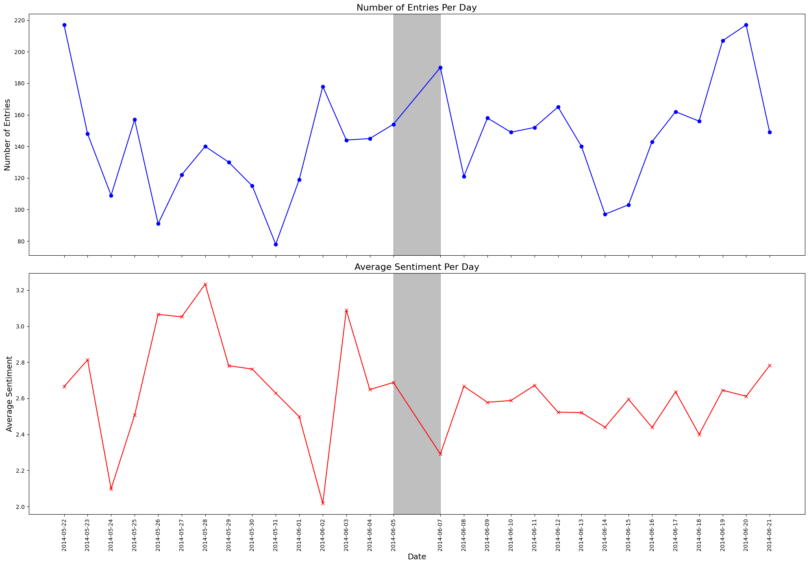
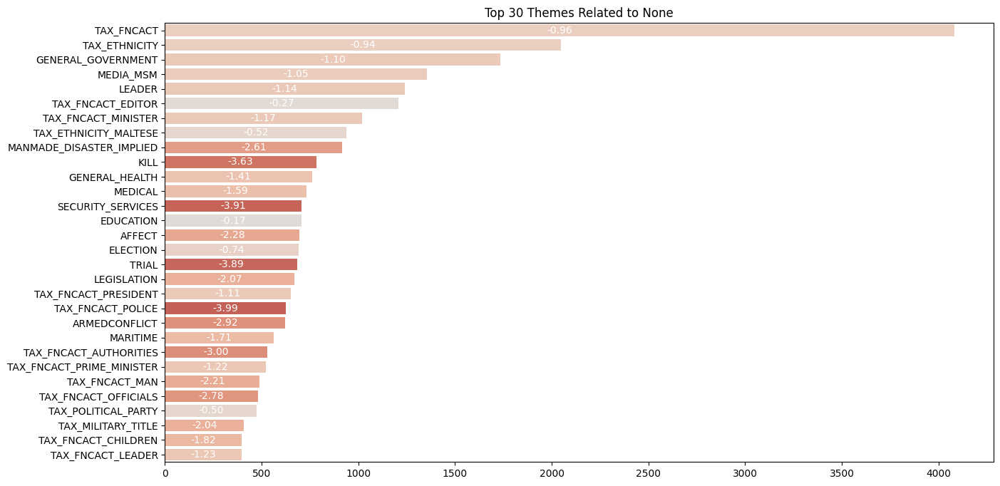
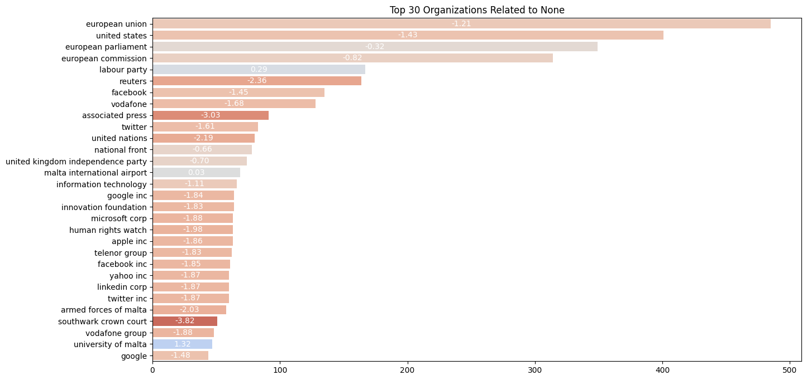
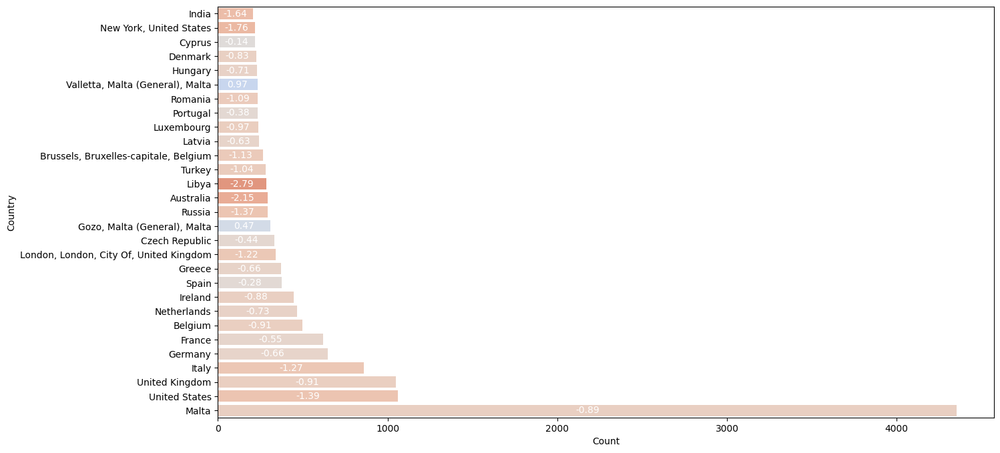

```python
import analysis_working as aw
import pandas as pd 
# import viz
filtered_df = pd.read_json('gdelt_mlt.json')
df = filtered_df
```

# Insert Title

### Tone and frequency analysis


```python
# Call the function with the DataFrame and a specified date to test it
aw.plot_from_dataframe(filtered_df, '20140606')

```


    

    


### Locations, Themes and Organizations


```python
aw.generate_visualizations(filtered_df, None, 30)
```

    c:\Users\Shiva Shah\Desktop\Projects\gdelt\analysis_working.py:53: FutureWarning: 
    
    Passing `palette` without assigning `hue` is deprecated and will be removed in v0.14.0. Assign the `y` variable to `hue` and set `legend=False` for the same effect.
    
      barplot_themes_reversed = sns.barplot(x=theme_counts_n, y=theme_names_n, palette=theme_colors_reversed)
    


    

    


    c:\Users\Shiva Shah\Desktop\Projects\gdelt\analysis_working.py:62: FutureWarning: 
    
    Passing `palette` without assigning `hue` is deprecated and will be removed in v0.14.0. Assign the `y` variable to `hue` and set `legend=False` for the same effect.
    
      barplot_orgs_reversed = sns.barplot(x=org_counts_n, y=org_names_n, palette=org_colors_reversed)
    


    

    


    c:\Users\Shiva Shah\Desktop\Projects\gdelt\analysis_working.py:91: FutureWarning: 
    
    Passing `palette` without assigning `hue` is deprecated and will be removed in v0.14.0. Assign the `y` variable to `hue` and set `legend=False` for the same effect.
    
      barplot_countries_reversed = sns.barplot(x='Count', y='Country', data=df_country_count_top20, palette=country_colors_reversed)
    


    

    


### Sources


```python

```
